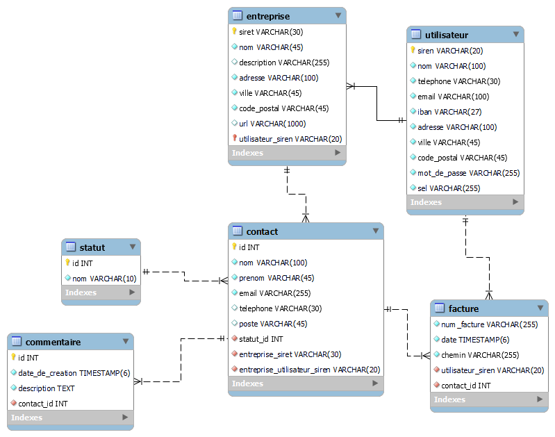

# __Customer Relationship Management__

Ce projet est un projet d'école consistant à créer un site de CRM en python avec le framework Flask

## Groupe sur le projet

----------------------------

- Kevin Lebeau : https://github.com/kevmorlo
- Emilien Cuny : https://github.com/ArToXxFR

## Langages utilisés ?

----------------------------

- Python
- HTML
- CSS

    Modèle physique de données :

  

## Framework

----------------------------

- Flask

## Contenu

### Backend

- Page de connexion
- Page de création de compte
- Connexion à la base de données
- Création de nouveaux contacts
- Page 404

### Frontend

- Navbar (75%)
- Page de connexion (50%)
- Page 404 (90%)

## Aperçu

#TODO

## Responsive ?

Le projet est adapté pour les plateformes mobiles, tablettes ordinateurs (sauf 4K)

## TODO LIST

### Backend

- Page de connexion
- Page de création de compte
- Connexion à la base de donnée
- Création de nouveaux contacts

### Frontend

- Absolument tout

## Installation du projet

### Prérequis

- Python
- Flask

#TODO

## License

Cette œuvre est mise à disposition selon les termes de la <a rel="license" href="http://creativecommons.org/licenses/by-sa/4.0/">
Licence Creative Commons Attribution -  Partage dans les Mêmes Conditions 4.0 International</a>. 

