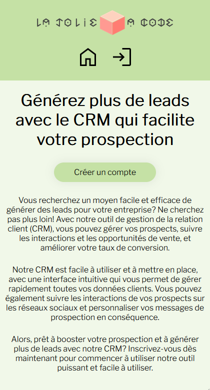
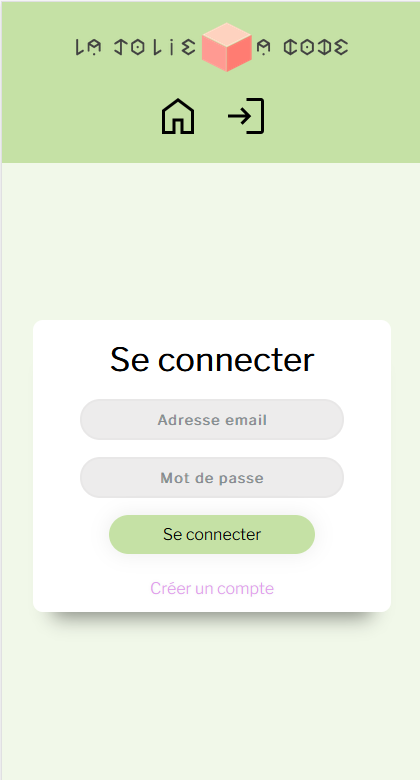

# __Customer Relationship Management__

Ce projet est un projet d'école consistant à créer un site de CRM en python avec le framework Flask

## Groupe sur le projet

----------------------------

- Kevin Lebeau : <https://github.com/kevmorlo>
- Emilien Cuny : <https://github.com/ArToXxFR>

## Langages utilisés ?

----------------------------

- Python
- HTML
- CSS

    Modèle physique de données :

  

## Framework

----------------------------

- Flask

## Contenu

## Aperçu

## Responsive ?

Le projet est adapté pour les plateformes mobiles, tablettes et ordinateurs (sauf 4K)

## Installation du projet

### Prérequis

- Python

Il vous faudra d'abord installer les bibliothèques Flask, flaskext-mysql, reportlab, argon2 et datetime avec la commande pip install

Une fois cela fait, il vous faudra créer une base de données, comme par exemple sur PHPMyAdmin, appelée crm de préférence pour simplifier la suite.

Vous devrez ensuite importer le fichier sql présent dans le dossier database dans votre base de données.

Enfin, il vous faudra plus que lancer le serveur avec la commande 'python ./crm_python' et vous connecter avec votre navigateur web !

## License

Cette œuvre est mise à disposition selon les termes de la <a rel="license" href="http://creativecommons.org/licenses/by-sa/4.0/">
Licence Creative Commons Attribution -  Partage dans les Mêmes Conditions 4.0 International</a>. 

